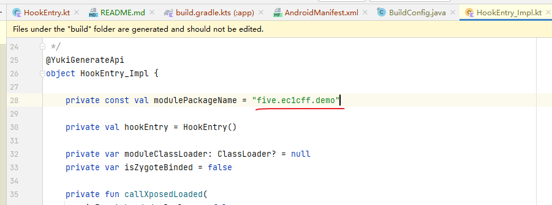
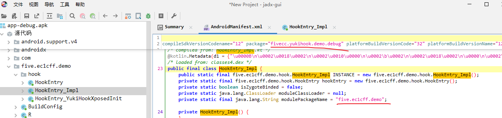
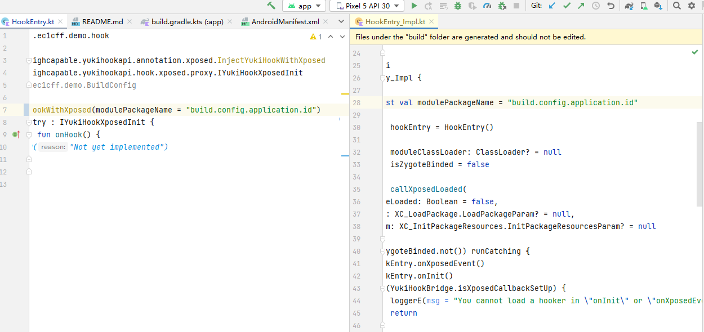

# YukiHookAPI `modulePackageName = BuildConfig.APPLICATION_ID` 无效 复现 Demo

[HookEntry.kt](app/src/main/java/five/ec1cff/demo/hook/HookEntry.kt) 中，指定 `modulePackageName = BuildConfig.APPLICATION_ID` 。

[build.gradle.kts:app](app/build.gradle.kts) 中，设置了不同于 `five.ec1cff.demo` 前的包名 `fivecc.yukihook.demo` ，并且对 debug 类型增加后缀 `.debug` 。

build 后，生成的 HookEntry_Impl 中 modulePackageName 仍然为根据规则匹配的包名 `five.ec1cff.demo` ，而非指定的包名。

`app/build/generated/ksp/debug/kotlin/five/ec1cff/demo/hook/HookEntry_Impl.kt`

jadx 反编译如下：

如果 modulePackageName 为常量字符串，则没有问题：

